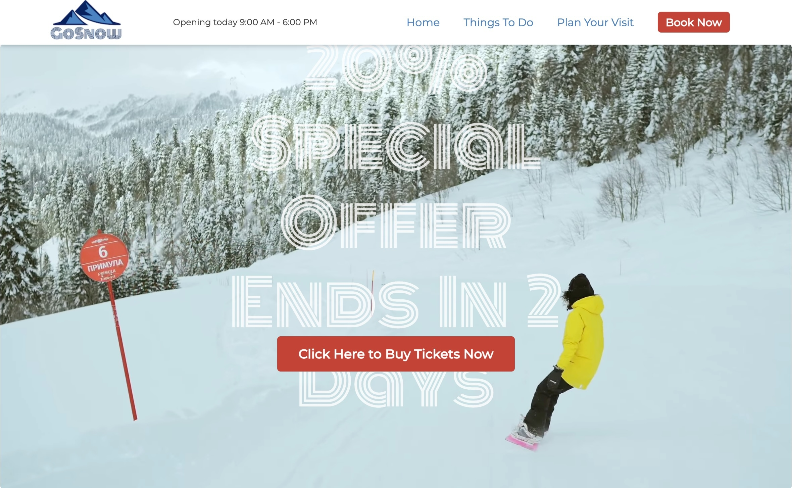
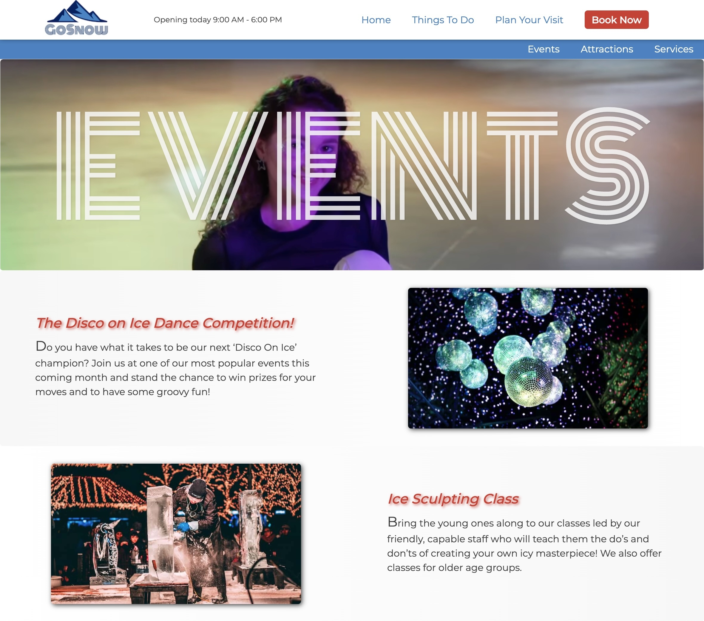
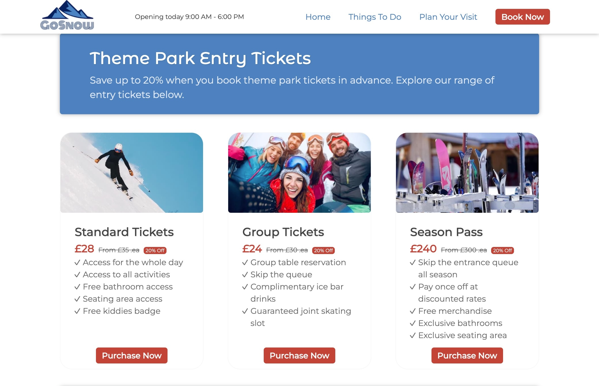
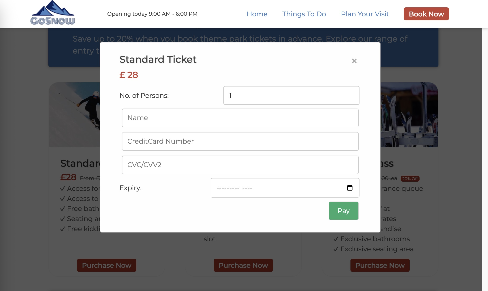

# 🎿 GoSnow Theme Park Website

> A modern, responsive website for GoSnow - a winter-themed amusement park in London featuring ice rinks, snowboarding areas, ice sculptures, and family-friendly attractions.
> 

## 🛠️ Tech Stack


## 🌟 Project Overview

This project was developed as part of the **CM1040 Web Development** coursework at University of London. GoSnow is a fictional theme park website that showcases winter sports activities, attractions, and visitor information with a focus on user experience and modern web design principles.

## 🎬 Live Demo

<div align="center">

[](https://youtu.be/I3ctk699Jcc)

_Click the thumbnail above to watch a complete walkthrough of the GoSnow website features and functionality_

</div>

## 🚀 Features

- **Multi-page responsive website** with consistent navigation and branding
- **Interactive ticket booking modals** with JavaScript functionality
- **Video backgrounds** and hero sections for engaging visual experience
- **Mobile-first responsive design** that works across all devices
- **Semantic HTML5** structure with proper accessibility considerations
- **CSS Grid and Flexbox** layouts for modern, flexible designs
- **Custom animations** and smooth user interactions
- **SEO optimized** with meta tags and Open Graph properties

## 📱 Pages

### **Home** (`index.html`)

Main landing page with hero video and park overview



### **Things To Do** (`things-to-do.html`)

Attractions and activities showcase



### **Plan Your Visit** (`plan-your-visit.html`)

Tickets, services, and visitor information



### Interactive Booking Modal



## 🛠️ Technologies & Skills Demonstrated

### Frontend Technologies

- **HTML5** - Semantic markup, accessibility, and modern web standards
- **CSS3** - Advanced styling, animations, responsive design
- **JavaScript** - DOM manipulation, event handling, interactive features
- **jQuery** - Simplified JavaScript operations and animations

### Design & UX Skills

- **Responsive Web Design** - Mobile-first approach using CSS Grid and Flexbox
- **UI/UX Design** - User-centered design with intuitive navigation
- **Visual Design** - Color theory, typography, and visual hierarchy
- **Cross-browser Compatibility** - Ensuring consistent experience across browsers

### Web Development Best Practices

- **Semantic HTML** - Proper use of HTML5 elements for better accessibility
- **CSS Methodology** - Organized stylesheets with custom properties (CSS variables)
- **Performance Optimization** - Optimized images and efficient code structure
- **SEO Implementation** - Meta tags, structured data, and search engine optimization
- **Version Control** - Project organization and file management

### Technical Features Implemented

- **CSS Animations** - Smooth transitions and hover effects
- **Modal Windows** - Interactive popup windows for ticket information
- **Video Integration** - Background videos with fallback support
- **Custom Fonts** - Google Fonts integration for enhanced typography
- **Normalize.css** - Cross-browser styling consistency

## 📁 Project Structure

```
├── index.html              # Main homepage
├── things-to-do.html       # Attractions page
├── plan-your-visit.html    # Visitor information page
├── assets/
│   ├── images/            # All image assets
│   └── videos/            # Background video files
├── styles/
│   ├── style.css          # Main stylesheet
│   ├── index.css          # Homepage specific styles
│   ├── things-to-do.css   # Attractions page styles
│   ├── plan-your-visit.css # Visitor page styles
│   └── normalize.css      # CSS reset/normalize
└── js/
    └── common.js          # JavaScript functionality
```

## 🎯 Learning Outcomes

Through this project, I developed and demonstrated proficiency in:

- **Frontend Web Development** - Building complete, functional websites from scratch
- **Responsive Design Principles** - Creating layouts that work on all screen sizes
- **User Experience Design** - Focusing on usability and user journey
- **Web Performance** - Optimizing loading times and user experience
- **Code Organization** - Maintaining clean, readable, and maintainable code
- **Problem Solving** - Debugging and implementing complex interactive features
- **Project Management** - Planning, organizing, and delivering a complete web project

## 🔧 Setup & Usage

1. Open the project folder in VS Code
2. Install the "Live Server" extension if you haven't already
3. Right-click on index.html and select "Open with Live Server"
4. The webpage will open in your browser automatically

## 🎨 Design Highlights

- **Winter Theme** - Consistent color scheme and imagery reflecting the park's winter sports focus
- **Modern Typography** - Montserrat font family for clean, readable text
- **Interactive Elements** - Hover effects, modal windows, and smooth transitions
- **Visual Hierarchy** - Clear content organization with proper spacing and contrast
- **Brand Consistency** - Unified design language across all pages

## 📧 Contact

**Yue Wu**  
Frontend Developer | University of London Student

[](https://www.linkedin.com/in/yuewuxd/)

---

_This project was completed as part of the CM1040 Web Development course at University of London. All code and design work represents original student coursework demonstrating fundamental web development skills and modern best practices._
